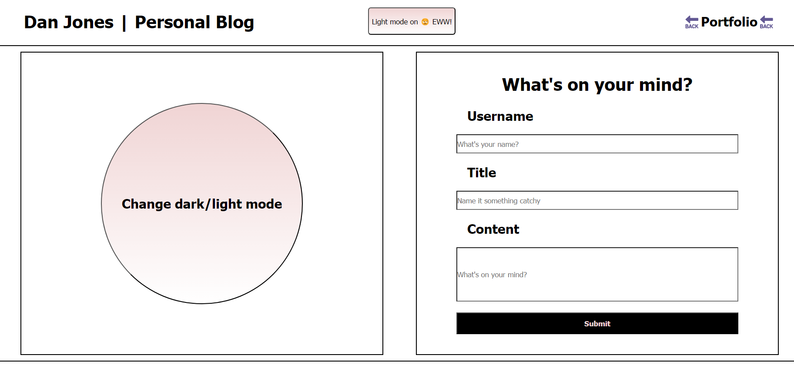

# Dan Jones Employee Personal Blog

## Descrption

This is a simple website for creating and storing blog posts. There is also a funciton for changing the theme of the webpage from dark to light. 

This applicaiton uses local storage to store a users blog posts as well as their dark mode setting.

## Table of Contents

- [ScreenShots](#screenshots)
- [Links](#links)
- [API](#api)
- [References](#references)
- [Resources](#resources)
- [Contributing](#contributing)
- [License](#license)

## Screenshots
Dark Mode:

Light Mode:

## Links

[Dan Jones Personal Blog](https://djinjones.github.io/Dan-Jones-Personal-Blog/)

## API

N/A

## References

- [Mdn](https://developer.mozilla.org/en-US/)
- [W3 schools](https://www.w3schools.com)

## Resources

- [Github banner generator](https://leviarista.github.io/github-profile-header-generator/)
- [Github markdown-badges](https://ileriayo.github.io/markdown-badges/)

## Contributing

N/A

## License

[MIT © Richard McRichface.](../LICENSE)
